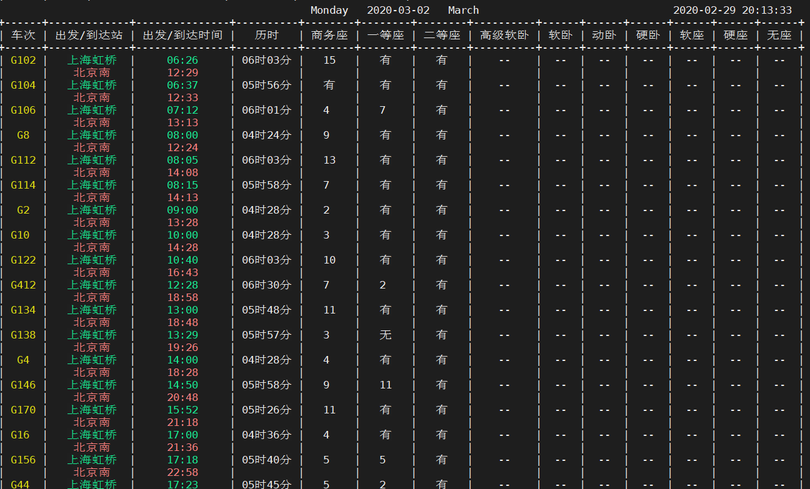

# 12306Tickets
get Trains information inquiry from 12306.cn

余票查询
### 安装依赖包
```bash
pip3 install -r install.txt
```
* requests 用于获取网页数据 
* docopt 解析命令行参数 
* prettytable 使用表格的形式打印数据
* colorama   为表格中的数据着色

### 参数
<pre>
tickets [-gdtkz] [(from)] [(to)] [(date)]

Options:
    -g     高铁
    -d     动车
    -t     特快
    -k     快速
    -z     直达
    -h   --help     display this help
    -v   --version  show version 

Example:
    tickets 上海 北京 0501
    tickets -gdt beijing shanghai 2018-08-25
</pre>

run
``` bash
python3 tickets.py [TrainType][FromStation][ToStation][Date]
```


